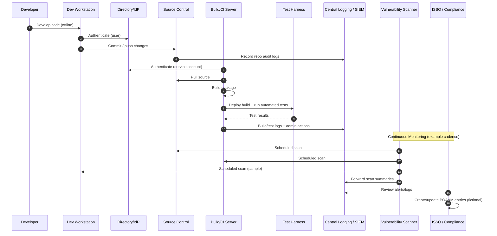

# Data Flow Diagram (Fictional)

> This diagram focuses on the **development → build → test → logging** flow inside an isolated LAN.

```mermaid
sequenceDiagram
  autonumber
  participant Dev as Developer
  participant WS as Dev Workstation
  participant IdP as Directory/IdP
  participant Git as Source Control
  participant CI as Build/CI Server
  participant Test as Test Harness
  participant SIEM as Central Logging / SIEM
  participant Scan as Vulnerability Scanner
  participant ISSO as ISSO / Compliance

  Dev->>WS: Develop code (offline)
  WS->>IdP: Authenticate (user)
  WS->>Git: Commit / push changes
  Git->>SIEM: Record repo audit logs

  CI->>IdP: Authenticate (service account)
  CI->>Git: Pull source
  CI->>CI: Build package
  CI->>Test: Deploy build + run automated tests
  Test-->>CI: Test results
  CI->>SIEM: Build/test logs + admin actions

  Note over Scan,ISSO: Continuous Monitoring (example cadence)
  Scan->>Git: Scheduled scan
  Scan->>CI: Scheduled scan
  Scan->>WS: Scheduled scan (sample)
  Scan->>SIEM: Forward scan summaries
  ISSO->>SIEM: Review alerts/logs
  ISSO->>ISSO: Create/update POA&M entries (fictional)
```
